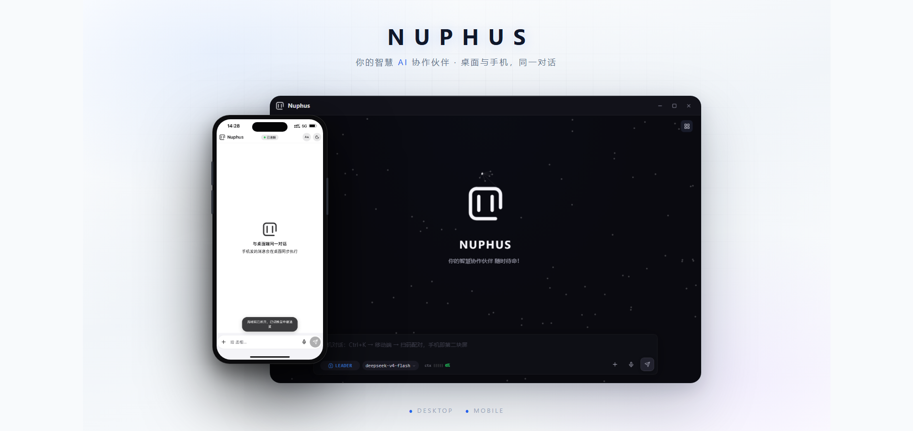

# Nuphus — 本地优先的 AI Agent

[](LICENSE)
[](https://rustup.rs/)
[](https://v2.tauri.app)
[](https://react.dev)

> **版本**: 0.1.x · **状态**: Alpha（积极开发中） · **平台**: Windows / macOS / Linux
> **技术栈**: Tauri v2 · Rust · React 18 · TypeScript

<p align="center">
  
</p>

**Nuphus 是运行在你电脑上的 AI Agent——本地、私有、拥有真实的桌面执行力，手机是它的第二块屏幕。**

它识别屏幕、操作鼠标键盘、控制窗口、读写文件、调度浏览器，把 LLM 的推理变成真实的自动化。数据留在本机，模型由你选择，Agent 替你做事情。

你在桌面发起的每一个会话，手机上都实时同步——同一份记忆、同一个 Agent、同一场对话，随时随地继续。

---

## 为什么是 Nuphus

现有的 Agent 产品都在各自的边界内工作：

| 品类 | 代表 | 边界 |
|------|------|------|
| 编码 Agent | Cursor、Cline | 出不了 IDE |
| 聊天 Agent | OpenClaw | 在聊天软件里遥控 |
| 云端 Agent | Codex Computer Use | 在别人的虚拟机里 |

Nuphus 打破了这些边界。它不只是「帮你写代码」的工具——它是**替代你日常工作的 Agent**，并且你走到哪里，它跟到哪里。

### 设计哲学

Agent 的根本矛盾：推理需要智能，但重复执行需要确定性。让 LLM 每次都用 token 解决 85% 相同的任务，是对算力和时间的双重浪费。

Nuphus 的解法——让 LLM 推理一次，编译为工作流，之后零 token 重复执行：

```
用户意图 → LLM 推理探索一次（编译） → 确定性工作流 → ChatAgent 智能决策点接入 → 引擎重复执行
```

编译是一次性成本，换来的是**确定性、可重复、极低边际成本**的自动化。

> **典型场景**：「每天下午 6 点备份我的项目文件夹到桌面」→ Nuphus 编译为工作流 → 此后每天自动执行，零 token、零对话。出门在外，手机上看一眼执行状态即可。

### 串行推理，并行执行

Nuphus 核心引擎用 Rust 构建，工具调用在毫秒级完成。延迟瓶颈在模型推理，不在引擎。

Agent 决策本身就是因果链——每一步依赖上一步的结果，桌面系统操作更应遵循串行逻辑。Nuphus 的并行体现在执行层：通过显式指令传递，它可以同时打开 Cline 修 bug、Claude Code 写测试、浏览器查文档——每个外部 Agent 有多少并行能力，Nuphus 就能调度多少并行。外部 Agent 拥有自己的上下文理解。Nuphus 在之上截图验证、阅读产出、汇总决策。

**串行的是思考，并行的是执行。**

---

## 核心亮点

### 真实桌面执行力

Nuphus 直接安装在你的操作系统上，拥有原生级的屏幕感知和输入控制能力：

- **操控任意 GUI** — 窗口 + OCR + 键鼠，任何桌面软件/网页都能自动化，无需对方提供 API
- **内置浏览器** — 可编程的浏览器内核，网页自动化、信息采集、表单交互都在本机完成
- **编程与项目分析** — 项目分析、代码生成、调试诊断、文件操作，深度理解项目上下文
- **多 Agent 调度** — 并行调度 Cline、Claude Code 等外部 Agent，统一汇总决策

### 双端实时同步：桌面干活，手机掌控

Nuphus 把「执行」和「掌控」分开：**桌面是 Agent 的双手，手机是你的遥控器。**

- **同一会话，双端同步** — 手机连接的正是桌面那个 Agent：发消息走同一个会话入口，桌面和手机共享历史、记忆与状态，任何一端都能继续对话
- **实时事件流** — Agent 的每一步（思考、工具调用、执行结果）通过 WebSocket 实时推送到手机，坐在沙发上就能看着电脑干活
- **工作流遥控** — 手机上直接暂停、恢复、停止正在执行的工作流，随时接管控制权
- **执行轨迹回放** — 手机上查看 Agent 的完整执行轨迹，每一步都透明可查
- **远程访问免费** — 局域网内自动直连（零配置）；出门在外通过中继服务器远程访问，不落盘、不转发内容，只做身份校验和路由

双通道自动切换：同一 WiFi 下手机直接连桌面（快、免费）；离开局域网自动走中继（稳定、可靠），回来自动切回直连。

### 本地优先，隐私自有

- **数据留在本机** — 对话、记忆、插件全部存储本地
- **本地 AI 引擎** — PP-OCRv4（OCR）、Candle（语义搜索）全部本地运行，日常识别零 API 消耗
- **4 层安全体系** — 权限开关 → 人在回路 → 注入检测 → 熔断保护
- **模型自由** — OpenAI / Anthropic / DeepSeek / Qwen / 智谱等主流厂商统一接入，随时切换

### 更多能力

| 能力 | 说明 |
|------|------|
| **记忆系统** | 跨会话经验积累，SQLite 持久化 + FTS5 + 向量语义检索，越用越懂你 |
| **零编译扩展** | 知识库、技能、工作流、ui-maps 均为纯文本文件，放入 `plugin/` 即生效 |
| **视觉感知三层** | 内置 OCR（零 API 消耗）→ 可配置视觉模型（复杂场景）→ 用户视觉引导（最灵活 fallback） |

---

## 安装

### npm 一键安装（推荐）

一条命令完成安装，自动匹配当前平台的二进制（Windows x64 / macOS arm64 / Linux x64），**无需下载安装包、无需 Node.js / Rust 环境**：

```bash
# 全局安装（提供 nuphus 命令）
npm install -g @nuphus/nuphus-desktop

# 或免安装体验（不写入全局）
npx @nuphus/nuphus-desktop
```

安装完成后在终端输入 `nuphus` 即可启动。

> 首次安装体积较大（桌面应用含本地 OCR / 语音模型），请耐心等待。

### 下载安装包

面向不熟悉命令行的用户，**无需命令行、无需 Node.js / Rust 环境**：

1. 从 [GitHub Releases](https://github.com/mrpulor-gh/nuphus/releases) 下载对应平台的安装包：
   - **Windows**：`.exe`（NSIS 安装包，用户级安装，**无需管理员权限**）
   - **macOS**：`.dmg`
   - **Linux**：`.deb` / `.AppImage`
2. 双击安装包完成安装（Windows 安装后桌面生成 **Nuphus** 快捷方式）
3. 双击快捷方式即可启动

### 从源码构建（开发者）

**前置条件：**

| 工具 | 版本 | 用途 |
|------|------|------|
| [Rust](https://rustup.rs/) | ≥ 1.78 | 核心引擎编译 |
| [Node.js](https://nodejs.org/) | ≥ 18 | Tauri 前端构建 |
| Tauri CLI | `cargo install tauri-cli --version "^2"` | 桌面应用开发 |

```bash
git clone https://github.com/mrpulor-gh/nuphus.git
cd nuphus

# 安装依赖（根目录 Tauri CLI + 前端依赖）
npm install
cd frontend && npm install && cd ..

# 启动桌面应用（开发模式，自动编译 Rust + 启动前端）
npx tauri dev

# 生产构建（输出安装包到 src-tauri/target/release/bundle/）
npx tauri build
```

> 根目录 `npm run dev` / `npm run build` 为纯前端命令；桌面应用请使用 `npx tauri dev` / `npx tauri build`。

### 首次配置

首次启动会弹出 2 步引导（以上所有安装方式均适用）：

1. **选择模型厂商** — 从预设模板中点选（OpenAI / Anthropic / DeepSeek / Qwen / Zhipu 等）
2. **填入 API Key** — 按 Enter 提交即完成配置

> 也支持环境变量免配置启动：`QWEN_API_KEY="sk-xxx" npx tauri dev`

### 连接手机

1. 在桌面端「手机」设置页开启移动端服务（默认端口 18772）
2. 手机浏览器打开配对页，输入配对密码完成绑定
3. 添加到主屏幕（PWA），以后像 App 一样使用

同一 WiFi 下自动局域网直连；离开局域网自动走中继远程通道，全程免配置。

---

## 架构概览

Nuphus 采用六层架构，自底向上，安全贯穿各层：

```
┌─────────────────────────────────────────────┐
│ Tauri 壳                                    │  ← 前端 UI + 系统级能力（通知、托盘、快捷键）
├─────────────────────────────────────────────┤
│ Runtime                                     │  ← 统一主循环，三模式路由（Free / Plan / Workflow）
├─────────────────────────────────────────────┤
│ Agent                                       │  ← Leader 决策 / ExecAgent 执行 / WorkflowAgent 设计
├─────────────────────────────────────────────┤
│ Transport                                   │  ← 多 Provider 抽象层（主流 AI 厂商统一接入）
├─────────────────────────────────────────────┤
│ Tools / Memory / Workflow                   │  ← 执行基础设施
├─────────────────────────────────────────────┤
│ Security / Permissions                      │  ← 贯穿所有层的安全链（注入检测 / 权限分级 / 审核）
└─────────────────────────────────────────────┘
```

**双端同步架构**：

```
┌──────────┐   WebSocket 实时事件流    ┌──────────────┐
│  手机 PWA │ ←──────────────────────→ │ 桌面 mobile  │
│ (聊天/遥控)│   POST /message 共享入口   │  server(18772)│
└──────────┘                          └──────┬───────┘
      ↕ 局域网直连（同 WiFi 自动）              │ 共享会话/记忆/状态
┌──────────┐                          ┌──────┴───────┐
│ 中继服务器 │ ←──── 远程通道（免费）────→ │  Nuphus 桌面  │
│ (不落盘)  │                          │  Agent 引擎   │
└──────────┘                          └──────────────┘
```

手机端发消息走 `submit_user_message(source="mobile")`，与桌面共用同一 `leader_agent` / busy 锁 / 去重逻辑——双端是**同一个 Agent 的两个界面**，不是两个独立系统。断线自动指数退避重连，重连成功后重拉历史补齐间隙，不会丢消息。

**数据流**：用户输入 → Tauri 事件 → Runtime 路由 → Leader 决策 → `task_dispatch` → ExecAgent 执行 → 结果返回 → 前端展示（桌面与手机同步）

---

## 配置

Nuphus 使用 TOML 配置文件，`src/config/mod.rs::load_registry` 按优先级搜索：

| 序号 | 路径 | 适用 |
|---|---|---|
| 1 | `<exe_dir>/config.toml` | 绿色版 / 便携部署 |
| 2 | `./config.toml` | 开发 |
| 3 | `~/.config/nuphus/config.toml` | Linux/macOS 用户级 |
| 4 | `~/.nuphus/config.toml` | 兼容旧版 |
| 5 | `<AppData>/nuphus/config.toml` | Windows 桌面版首次启动自动生成 |

> 引导完成后可在「设置 → 模型」面板修改配置（当前以明文保存到本地 config.toml，加密存储在路线图中）。

---

## 设计原则

1. **本地优先** — 数据默认留本机，云端只在用户选择时介入
2. **极简心智** — 每个功能都尽量简单，避免过度抽象
3. **确定性优先** — 能编译为工作流就不反复推理，能复用就不重写
4. **Long-Term First** — 优先选择与现有架构一致、可维护的方案
5. **克制优于堆叠** — 每个新功能必须证明自己不可替代
6. **闭环设计** — 每个功能模块从输入到产出形成完整闭环

---

## 如何贡献

Nuphus 是一个社区驱动的开源项目。除了代码贡献，你还可以通过以下方式参与生态建设：

### 贡献插件（后续开放）

| 插件类型 | 说明 | 示例 |
|---------|------|------|
| **ui-maps** | 任何软件的界面布局描述（按钮位置、窗口识别特征） | Photoshop 导出面板、企业 ERP 系统布局 |
| **workflows** | 可复用的工作流模板 | "每日备份项目文件夹"、"批量图片压缩" |
| **skills** | 领域方法论和操作指南 | "前端 UI 设计规范"、"特定框架的代码模式" |
| **knowledge** | 项目领域知识文档 | API 参考、配置说明、架构文档 |

所有插件均为纯文本文件（.md / .json），放入 `plugin/` 对应目录即可被 Nuphus 加载。

### 参与讨论

- GitHub Issues：Bug 报告和功能请求
- GitHub Discussions：使用问题、经验分享、插件推荐

---

## 许可

Copyright © 2026 Nuphus Team · Apache License 2.0